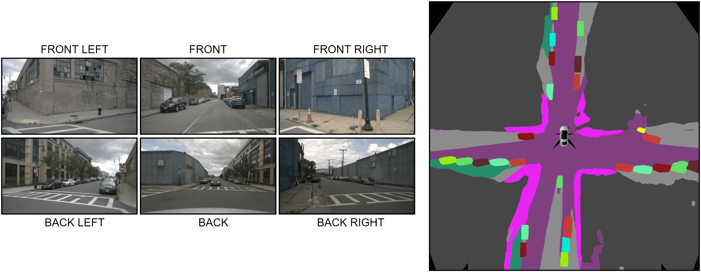

# Bird's-Eye-View Panoptic Segmentation Using Monocular Frontal View Images

This repository contains the PyTorch implementation of the PanopticBEV model proposed in our RA-L 2021 paper [Bird's-Eye-View Panoptic Segmentation Using Monocular Frontal View Images](https://arxiv.org/abs/2108.03227).

Our approach, PanopticBEV, is the state-of-the-art approach for generating panoptic segmentation maps in the bird's eye view using only monocular frontal view images.



If you find this code useful for your research, please consider citing our paper:
```
@article{gosala2021bev,
  title={Bird's-Eye-View Panoptic Segmentation Using Monocular Frontal View Images},
  author={Gosala, Nikhil and Valada, Abhinav},
  journal={arXiv preprint arXiv:2108.03227},
  year={2021}
}
```

## Relevant links
- [Paper](https://arxiv.org/abs/2108.03227)
- [Video](https://www.youtube.com/watch?v=HCJ1Hi_y9x8)
- [Project Webpage](http://panoptic-bev.cs.uni-freiburg.de/)

## System requirements
- Linux (Tested on Ubuntu 18.04)
- Python3 (Tested using Python 3.6.9)
- PyTorch (Tested using PyTorch 1.8.1)
- CUDA (Tested using CUDA 11.1)

## Installation
a. Create a python virtual environment and activate it.
```shell
python3 -m venv panoptic_bev
source panoptic_bev/bin/activate
```
b. Update `pip` to the latest version.
```shell
python3 -m pip install --upgrade pip
```
c. Install the required python dependencies using the provided `requirements.txt` file.
```shell
pip3 install -r requirements.txt
```
d. Install the PanopticBEV code.
```shell
python3 setup.py develop
```
## Obtaining the datasets
Please download the datasets from [here](http://panoptic-bev.cs.uni-freiburg.de/#dataset) and follow the instructions provided in the encapsulated readme file.

## Code Execution

### Configuration parameters
The configuration parameters of the model such as the learning rate, batch size, and dataloader options are stored in the `experiments/config` folder.
If you intend to modify the model parameters, please do so here.

### Training and Evaluation
The training and evaluation python codes along with the shell scripts to execute them are provided in the `scripts` folder. 
Before running the shell scripts, please fill in the missing parameters with your computer-specific data paths and parameters.

To train the model, execute the following command after replacing `*` with either `kitti` or `nuscenes`.
```shell
bash train_panoptic_bev_*.sh
```

To evaluate the model, execute the following command after replacing `*` with either `kitti` or `nuscenes`.
```shell
bash eval_panoptic_bev_*.sh 
```

## Acknowledgements
This work was supported by the Federal Ministry of Education and Research (BMBF) of Germany under ISA 4.0 and by the Eva Mayr-Stihl Stiftung.

This project contains code adapted from other open-source projects. We especially thank the authors of:
- [Mapillary Seamseg](https://github.com/mapillary/seamseg)
- [Yet-Another-EfficientDet-Pytorch](https://github.com/zylo117/Yet-Another-EfficientDet-Pytorch)

## License
This code is released under the [GPLv3](https://www.gnu.org/licenses/gpl-3.0.en.html) for academic usage.
For commercial usage, please contact [Nikhil Gosala](https://rl.uni-freiburg.de/people/gosala).